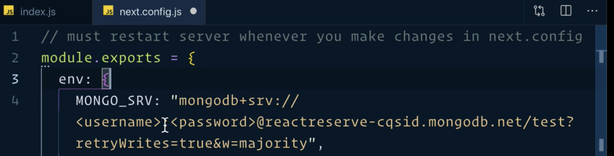

## Followed the tutorial MERN Stack - The Complete Guide

To run the development server using next use `npm run dev` in your terminal

Technologies

Main dependencies

| Technology        | Purpose                     | Description                                                                                                                      |
| ----------------- | --------------------------- | -------------------------------------------------------------------------------------------------------------------------------- |
| axios             | HTTP requests               | Axios makes it easy to send asynchronous HTTP requests to REST endpoints and perform CRUD operations                             |
| bcrypt            | Encryption                  |                                                                                                                                  |
| mongoose          | ODM                         | Mongoose is an Object Data Modeling (ODM) library for MongoDB and Node + helps to connect to MONGO. js.                          |
| next              | react framework             | Server rendering, pages directory that takes care of routes, can deploy as serverless app - functions run only when they need to |
| react             | Frontend library            | Component based library. Updates and renders components when data changes.                                                       |
| semantic-ui-react | Component library for react | Provides prebuilt components components that can easily be styled                                                                |
| shortid           | id generator                | Generates short non-sequential url-friendly unique ids                                                                           |
|                   |                             |                                                                                                                                  |

# Creating API with Node + Express

## Fetching Data on the Server with getInitialProps

**Next** gives you the option with `getInitialProps`to fetch data on the server as compared to waiting until after the component mounts.

### :file_folder: Pages

- :large_blue_diamond: **MyApp** Component - `pages/_app.js`
- :small_orange_diamond: **Home** component - `pages/index.js`

:large_blue_diamond: Home

```Javascript

function Home(props){

}

Home.getInitialProps = () => {
  //fetch data on server
  const url = "http://localhost:3000/api/products";
  const response = await axios.get(url);
  ///return response data as an object
   return { products: response.data };


}
```

- An object is returned
- It needs to be merged with existing props

:large_blue_diamond: **MyApp** Component - `pages/_app.js`

- use method getInitialProps()

```javascript
  static async getInitialProps({ Component, ctx }) {
    let pageProps = {};

    if (Component.getInitialProps) {
      pageProps = await Component.getInitialProps(ctx);
    }
    return { pageProps: pageProps };

  }
```

1. `getInitialProps` - can be accessed outside class component because it is a `static` method so make it a `static` method
2. Get access to page Component by destructuring the parameters of get Initial props `{Component}`
3. - Create a pageProps object to store the data from getInitial props.
4. check if components have a getInitialProps property
5. If it does execute it on the component `await Component.getInitialProps(ctx).`
   - . Pass ctx parameter - To execute it we need to provide more information which is provided from a parameter `ctx`. ctx provides information such as current route, request/ response info.
   - Usually getInitialProps is an async function so need to add `await` + make getInitialProps an `async` function. `await` only works on async functions
6. pageProps is set to the result of this
7. Since it needs an **object** returned return **an object that includes the object** `pageProps`

8. Pass the information down to component

   ```
   render() {
    const { Component, pageProps } = this.props;

    return (
      <Layout>
        {/* ... spread operator to spread in all of the props flatten into individual properties and values   */}
        <Component {...pageProps} />
      </Layout>
    );
   }
   ```

````
  - Destructure `pageProps` from `this.props`
  - Pass to Component using object spreader to spread in all of the b

-

---

# Mongo

### Mongo Atlas

- cloud service that hosts mongo DB on a remote server

### Configure Mongo Atlas

1. - Create a cluster

- Choose cloud provider and region
- Select Cluster Tier

2. Connect

**Whitelist**- allow access from everywhere to make it easier in production, eliminate potential errors

Create a **mongoDB user**

Copy Connection string

:file_folder: Place it in `next.config.js` as an **environment variable** to make it secure


- Provide username and password
- Can access in a different file with `process.env.MONGO.SRV`

:file_folder: In `Utils/connectDB`

**Depedencies**

- mongoose

1. Make a connection object
2. Make a function `connectDB`

3. Use new database connection

```Javascript
async function connectDb() {}
const db = await mongoose.connect(process.env.MONGO.SRV){
useCreateIndex: true,
useFindAndModify: false,
useNewUrlParser: true,
useUnifiedTopology: true,
});
````

| Code                                            | Analysis                                                                  |
| ----------------------------------------------- | ------------------------------------------------------------------------- |
| `mongoose.connect()`                            | Function to connect to database                                           |
| Arguement - `process.env.MONGO.SRV`             | Pass database link stored in env variable                                 |
| `async` `await`                                 | function returns a promise so needs await it and make it a async function |
| `await mongoose.connect(process.env.MONGO.SRV)` | Returns a reference to database                                           |
| `const db`                                      | Reference saved as a variable                                             |
| Object - `{useCreateIndex: true ...}`           | Removes warnings from Mongo deprecations                                  |
